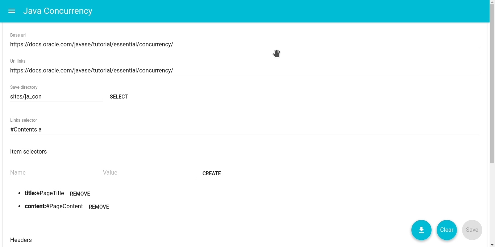
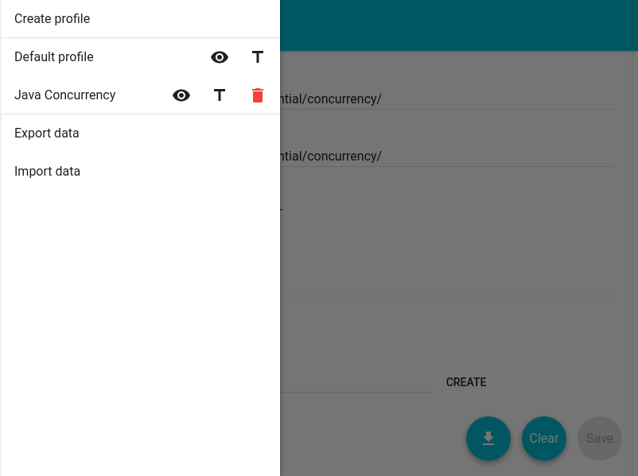
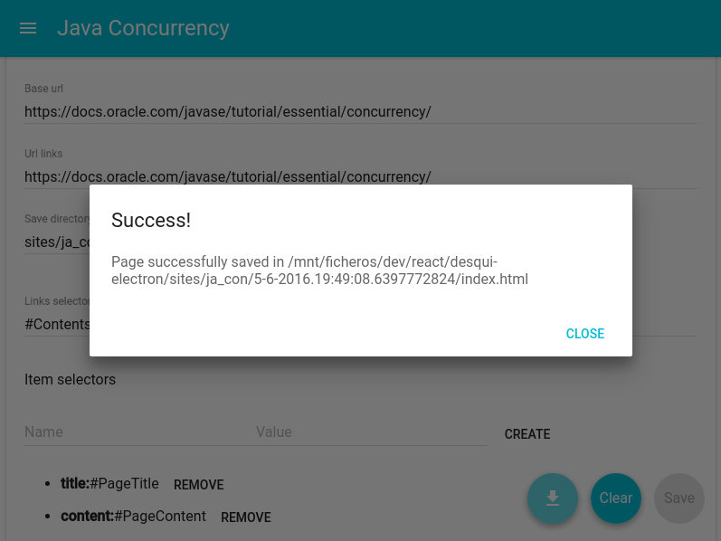

# desqui-app
A desktop application to use [Desqui](https://github.com/tomymolina/desqui) using technologies like React, Electron and Flux.

## Running the application (only for devs)

1. Install Atom Electron: `npm install -g electron-prebuilt`.
2. Install Webpack: `npm install -g webpack`.
3. Install project modules: `npm install`.
2. Clone this repository: `git clone https://github.com/tomymolina/desqui-app`
3. Open a terminal in the folder where you cloned the repository.
4. Run `webpack`.
4. Run `electron main.js`.

## Screenshots

---

---

## Profile example
You can download a profile example to test the app in `examples/profile_example.json`.

## License
Copyright 2016 Martín Molina Álvarez

Licensed under the Apache License, Version 2.0 (the "License");
you may not use this file except in compliance with the License.
You may obtain a copy of the License at

    http://www.apache.org/licenses/LICENSE-2.0

Unless required by applicable law or agreed to in writing, software
distributed under the License is distributed on an "AS IS" BASIS,
WITHOUT WARRANTIES OR CONDITIONS OF ANY KIND, either express or implied.
See the License for the specific language governing permissions and
limitations under the License.
